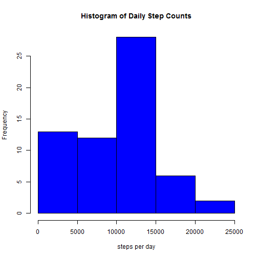
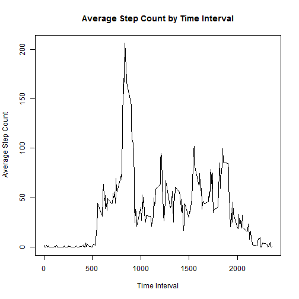
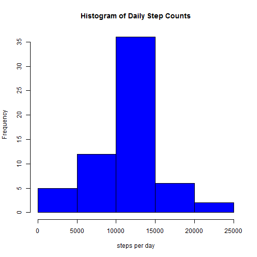
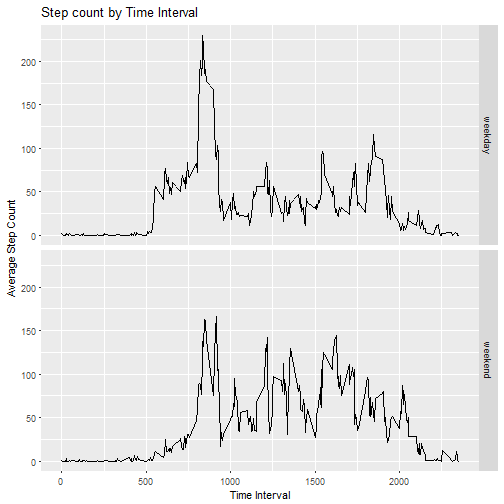

## Loading and Preprocessing the Data

The first step is to load the dataset in to R.  We will download the zip file in the provided link to a new folder we will create in the working directory called 'data'.  We will then unzip the file and load the csv file into R as a variable named data


```r
if(!dir.exists("./data")){
    dir.create("./data")
    }
download.file('https://github.com/bgyarno/RepData_PeerAssessment1/blob/master/activity.zip', "./data/ProjectData.zip")
unzip("./data/ProjectData.zip")
```

```
## Warning in unzip("./data/ProjectData.zip"): error 1 in extracting from zip
## file
```

```r
data <- read.csv('activity.csv')
```

Next we will take a quick look at the data using the summary and str functions.  


```r
summary(data)
```

```
##      steps                date          interval     
##  Min.   :  0.00   2012-10-01:  288   Min.   :   0.0  
##  1st Qu.:  0.00   2012-10-02:  288   1st Qu.: 588.8  
##  Median :  0.00   2012-10-03:  288   Median :1177.5  
##  Mean   : 37.38   2012-10-04:  288   Mean   :1177.5  
##  3rd Qu.: 12.00   2012-10-05:  288   3rd Qu.:1766.2  
##  Max.   :806.00   2012-10-06:  288   Max.   :2355.0  
##  NA's   :2304     (Other)   :15840
```

```r
str(data)
```

```
## 'data.frame':	17568 obs. of  3 variables:
##  $ steps   : int  NA NA NA NA NA NA NA NA NA NA ...
##  $ date    : Factor w/ 61 levels "2012-10-01","2012-10-02",..: 1 1 1 1 1 1 1 1 1 1 ...
##  $ interval: int  0 5 10 15 20 25 30 35 40 45 ...
```

We see several missing observations of the steps variable, but we will address this issue later on.  Aside from this, the dataset looks relatively clean.  The only change we will make right now is converting the data variable to a date format using the as.POSIXct function


```r
data$date <- as.POSIXct(data$date)
```

## Determining the Average Number of Steps Taken per Day

We calculate the total number of steps taken per day by grouping the dataset by date and adding the steps taken for each day using the summarize function in the dplyr package


```r
library(dplyr)
total <- summarize(group_by(data, date), sum = sum(steps, na.rm = TRUE))
print(total)
```

```
## # A tibble: 61 x 2
##          date   sum
##        <dttm> <int>
##  1 2012-10-01     0
##  2 2012-10-02   126
##  3 2012-10-03 11352
##  4 2012-10-04 12116
##  5 2012-10-05 13294
##  6 2012-10-06 15420
##  7 2012-10-07 11015
##  8 2012-10-08     0
##  9 2012-10-09 12811
## 10 2012-10-10  9900
## # ... with 51 more rows
```


When we look at a histogram of the number of steps per day, we see that the 10,000 - 15,000 steps is the most common daily step count.


```r
hist(total$sum, 
     main = "Histogram of Daily Step Counts", 
     xlab = "steps per day", 
     col = "blue")
```



We then calcuate the mean and median daily step counts.  Notice that the mean is lower than the median due to the fact that the distribution of steps is skewed


```r
mean(total$sum)
```

```
## [1] 9354.23
```

```r
median(total$sum)
```

```
## [1] 10395
```

##Identifying the Average Daily Activity Pattern

In order to construct a plot showing the average level of step activity for each time interval, we first create a data frame that summarizes the data by interval and calcuates the average number of steps in each interval


```r
intervals <- summarize(group_by(data, interval), avg = mean(steps, na.rm = TRUE))
with(intervals, plot(interval, avg, 
                     type = "l",
                     main = "Average Step Count by Time Interval",
                     xlab = "Time Interval", 
                     ylab = "Average Step Count"))
```



This plot shows us that the step count spikes signficantly between around 800 and 900.  We can identify the exact time interval that the highest average activity levels.

```r
intervals[intervals$avg == max(intervals$avg), "interval"]
```

```
## # A tibble: 1 x 1
##   interval
##      <int>
## 1      835
```

##Imputing Missing Values

I mentioned earlier that this dataset has several missing values


```r
missing <- sum(is.na(data))
print(missing)
```

```
## [1] 2304
```

in fact there are 2304 missing values in the dataset.  In order to address this issue, we will replace all of the missing values with the average number of steps taken during the specified time interval.  

We will use a for loop to accomplish this and store the updated values in a new data frame


```r
imputed <- data
for (i in 1:nrow(imputed)){
    if(is.na(imputed$steps[i])){
        imputed$steps[i] <- mean(imputed$steps[imputed$interval == imputed$interval[i]], na.rm = TRUE)
    }
}
```

Now let's look at the updated histogram that includes the imputed values, as well as updated mean and median values


```r
total <- summarize(group_by(imputed, date), sum = sum(steps, na.rm = TRUE))

hist(total$sum, 
     main = "Histogram of Daily Step Counts", 
     xlab = "steps per day", 
     col = "blue")
```



```r
mean(total$sum)
```

```
## [1] 10766.19
```

```r
median(total$sum)
```

```
## [1] 10766.19
```

Imputing the mising values has the effect of normalizing the distribution of steps per day.  We see this in the histogram as well as by the fact that the mean and median are equal.

It appears that the subject missed several full days of recording values, and inserting the average step count for each interval has the effect of moving these days from the zero category to the most common category.  

##Weekend vs. Weekday Activity Patterns

We will start by creating a new factor variable indicating if the date is a weekday or weekend


```r
imputed$weekday <- factor(c("weekday", "weekend"))
imputed$weekday <- ifelse(weekdays(imputed$date) %in% c("Saturday", "Sunday"), "weekend", "weekday")
```

This new variable can be used plot the average step counts for each time interval for both weekends and weekdays, to determine if there is a difference in activity pattern between the two.  We will use the ggplot package for this plot


```r
library(ggplot2)
weekday_intervals <- summarize(group_by(imputed, weekday, interval), avg = mean(steps))
ggplot(weekday_intervals, aes(interval, avg)) + geom_line() + facet_grid(weekday ~ .) + labs(title = "Step count by Time Interval", x = "Time Interval", y = "Average Step Count")
```



The plot shows us that total steps are more equally distributed throughout the day on the weekends, with multiple peaks ranging from  125 - 175 steps, as compared to weekdays where there is one large spike up to 225 and then several small peaks at or below 100


